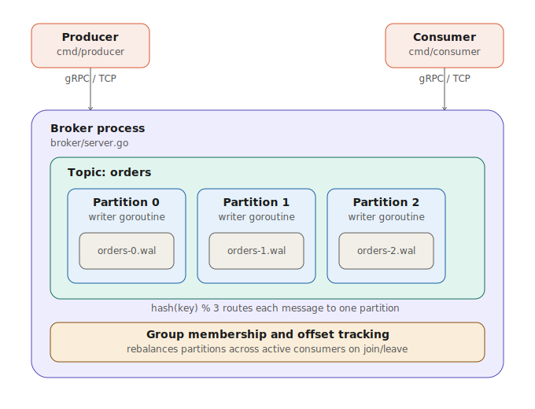

# MiniKafka

A Kafka-inspired distributed message broker built in Go featuring partitioned logs, concurrent producers, consumer groups, offset tracking, write-ahead logging, crash recovery, and networked communication via gRPC.

The project explores the core engineering concepts behind event-driven systems and distributed messaging platforms, with a focus on concurrency safety, durability, partitioning strategies, and consumer group coordination.



## Status

🚧 Work in progress — built incrementally over 10 days.

-[x] Core `Partition` log with single-writer-goroutine concurrency model
- [x] `Topic` with key-based hash routing across partitions
- [x] Write-ahead log (WAL) — persists messages to disk, survives crashes/restarts, verified with a crash-recovery test
- [x] gRPC server — producer and consumer run as separate processes talking to the broker over the network
- [x] Consumer groups with per-partition offset tracking ("resume where I left off")
- [x] Consumer group rebalancing — partitions redistribute automatically when consumers join or leave
- [x] Concurrency-safety verified with stress tests (50 concurrent producers, 5,000 messages, zero duplicate/skipped offsets)
- [x] Load tested: 535 msgs/sec, p99 latency 109ms, 0 failures across 10,000 concurrent network requests (see `cmd/loadtest/RESULTS.md`)
- [ ] Heartbeat/timeout-based eviction (a consumer that crashes without calling Leave is never detected — known limitation, documented in code comments)


## 📊 Performance Highlights

* 535 messages/sec throughput
* 10,000 concurrent network requests tested
* 109 ms p99 latency
* 50 concurrent producers
* 5,000-message concurrency stress test
* Zero duplicate offsets observed
* Zero skipped offsets observed
* Successful crash recovery validation

## 🧠 Engineering Challenges Solved

### Concurrent Offset Assignment

Ensured offsets remain strictly ordered even under heavy concurrent producer activity.

### Crash Recovery

Implemented a write-ahead log capable of restoring messages and offsets after unexpected shutdowns.

### Consumer Group Coordination

Built partition ownership and rebalancing logic that redistributes partitions when consumers join or leave.

### Networked Communication

Moved producers and consumers into separate processes using gRPC, turning the broker into a true distributed system rather than an in-process library.


## Why this design

**One writer goroutine per partition.** All appends to a partition's log go through a single goroutine, reached only via a channel — not a shared mutex on the hot write path. This avoids lock contention entirely and makes offset assignment trivially correct, since there's never a race between "read the last offset" and "append the next message." Reads are far more frequent than writes in typical pub/sub workloads, so they go straight to the in-memory log under an `RWMutex` instead of waiting behind the writer.

**Hash-based partition routing.** Messages are routed to a partition via `hash(key) % numPartitions`. This guarantees all messages sharing a key land on the same partition, preserving relative order for that key — the same ordering guarantee real Kafka makes.

**Write-ahead log with fsync-per-write.** Every message is written to disk and explicitly `fsync`'d before being acknowledged, so a crash immediately after a successful write can never lose that message. This is the safest possible durability choice, and it's also the system's main throughput bottleneck (see `cmd/loadtest/RESULTS.md` for the measured tradeoff and what batching writes would do instead).

**Consumer groups as a simple offset map, with round-robin rebalancing.** A consumer group tracks the last committed offset per `(topic, partition)`. On join or leave, partitions are redistributed round-robin across whichever consumers are currently active — simple and correct, though it doesn't try to minimize partition movement the way Kafka's "sticky" assignor does.

**gRPC over a hand-written protocol.** Producers and consumers are separate OS processes that talk to the broker over real TCP connections (see `proto/kafka.proto` for the wire contract), not in-process function calls — this is what makes it an actual distributed system rather than a library.


## Project structure

```
broker/

message.go              — core Message type

partition.go             — concurrent, single-writer, WAL-backed append-only log

topic.go                  — routes messages to partitions by key hash

wal.go                     — write-ahead log: persistence + crash recovery

consumer_group.go        — tracks committed offsets per group

group_membership.go      — consumer join/leave + round-robin rebalancing

server.go                  — gRPC service implementation

*_test.go                  — concurrency, crash-recovery, and rebalancing tests

cmd/

broker/main.go             — starts the gRPC server, listens on :50051

producer/main.go           — gRPC producer client

consumer/main.go           — gRPC consumer client with group join + offset commit

loadtest/main.go           — concurrent load test, measures throughput/latency

loadtest/RESULTS.md        — documented benchmark results and bottleneck analysis

proto/

kafka.proto                 — gRPC service contract

kafka.pb.go, kafka_grpc.pb.go — generated from the .proto file

docs/

architecture.svg            — architecture diagram

## Running it

```bash
go mod tidy

# Terminal 1: start the broker (listens on :50051)
go run ./cmd/broker

# Terminal 2: send messages
go run ./cmd/producer

# Terminal 2: read messages back
go run ./cmd/consumer

# Load test (20 concurrent producers x 500 messages each)
go run ./cmd/loadtest

# Run the test suite
go test ./broker/... -v
```

## What's tested

- 50 concurrent producers writing 5,000 messages total never produce duplicate or skipped offsets
- Messages sharing the same key are always routed to the same partition
- A partition that's closed (simulating a crash) and reopened recovers every message from disk with correct offsets, and correctly continues the offset sequence afterward
- Two consumers joining a group split partitions with no overlap; a consumer leaving causes its partitions to be picked up by whoever remains

## Roadmap

| Day | Milestone |
|---|---|
| 1–2 | Core partition/topic engine, consumer groups, CLI producer/consumer ✅ |
| 3 | Write-ahead log persistence + crash recovery ✅ |
| 5 | gRPC server, network-based producer/consumer ✅ |
| 6 | Consumer group join/leave + round-robin rebalancing ✅ |
| 8 | Load testing, measured throughput/latency, bottleneck analysis ✅ |
| 9–10 | Architecture diagram, documentation polish ✅ |